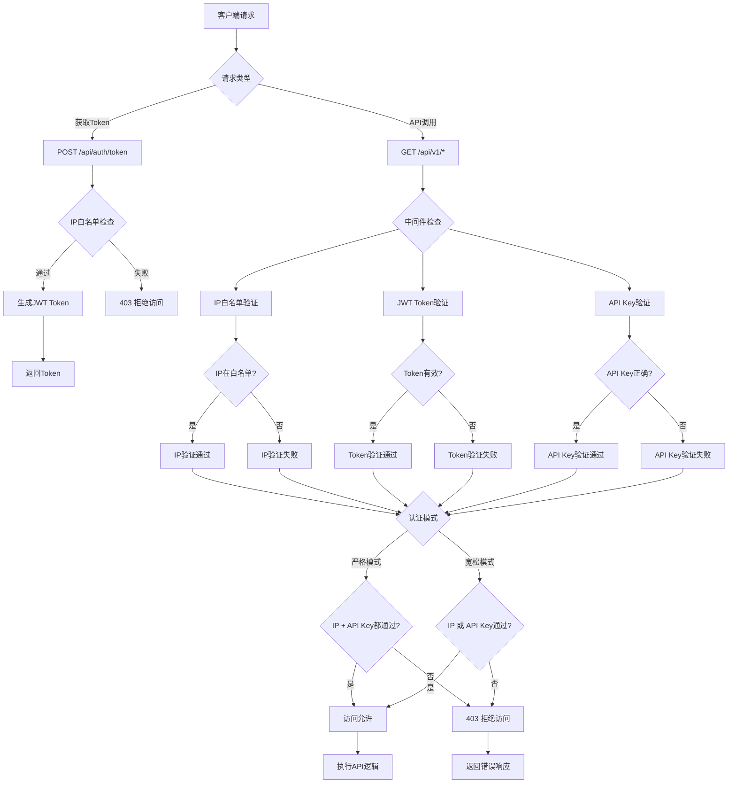

# 后端认证流程详解

## 概述

本文档详细说明了 Whosee WHOIS 后端服务的认证机制，包括 JWT Token 获取、API 密钥验证、IP 白名单等安全措施。

## 认证架构

### 双重认证机制

后端采用 **双重认证机制**：
1. **JWT Token 认证** - 临时访问令牌
2. **API Key 认证** - 长期访问密钥
3. **IP 白名单** - 网络层访问控制

### 认证模式

- **严格模式** (`IP_WHITELIST_STRICT_MODE=true`): 必须同时通过 IP 白名单 + API 密钥验证
- **宽松模式** (`IP_WHITELIST_STRICT_MODE=false`): 通过 IP 白名单 OR API 密钥验证之一即可

## 认证流程图



## 安全组件详解

### 1. JWT Token 管理

#### Token 生成 (`middleware/auth.go`)

```go
// GenerateToken 生成临时JWT令牌
func GenerateToken(c *gin.Context) {
    ip := c.ClientIP()
    
    // IP限流检查
    if !checkRateLimit(ip) {
        c.JSON(429, gin.H{"error": "请求过于频繁"})
        return
    }
    
    // 生成随机nonce
    nonce := generateNonce()
    
    // 创建JWT声明
    claims := jwt.MapClaims{
        "ip":    ip,
        "nonce": nonce,
        "exp":   time.Now().Add(30 * time.Second).Unix(),
        "iat":   time.Now().Unix(),
    }
    
    // 使用JWT_SECRET签名
    token := jwt.NewWithClaims(jwt.SigningMethodHS256, claims)
    tokenString, _ := token.SignedString([]byte(os.Getenv("JWT_SECRET")))
    
    // 存储nonce到Redis
    storeNonce(nonce, ip)
    
    c.JSON(200, gin.H{"token": tokenString})
}
```

#### Token 验证 (`middleware/auth.go`)

```go
// AuthRequired JWT认证中间件
func AuthRequired() gin.HandlerFunc {
    return func(c *gin.Context) {
        // 获取Authorization头
        authHeader := c.GetHeader("Authorization")
        if !strings.HasPrefix(authHeader, "Bearer ") {
            c.JSON(401, gin.H{"error": "缺少认证令牌"})
            c.Abort()
            return
        }
        
        tokenString := authHeader[7:] // 移除"Bearer "
        
        // 解析JWT
        token, err := jwt.Parse(tokenString, func(token *jwt.Token) (interface{}, error) {
            return []byte(os.Getenv("JWT_SECRET")), nil
        })
        
        if !token.Valid {
            c.JSON(401, gin.H{"error": "无效的认证令牌"})
            c.Abort()
            return
        }
        
        // 验证nonce
        claims := token.Claims.(jwt.MapClaims)
        if !verifyNonce(claims["nonce"].(string), claims["ip"].(string)) {
            c.JSON(401, gin.H{"error": "令牌已失效"})
            c.Abort()
            return
        }
        
        c.Next()
    }
}
```

### 2. IP 白名单验证 (`middleware/ip_whitelist.go`)

#### 配置结构

```go
type IPWhitelistConfig struct {
    APIKey         string        // API密钥
    APIDevMode     bool          // 开发模式标志
    TrustedIPs     string        // 信任的IP列表（逗号分隔）
    TrustedIPsList []string      // 预定义的信任IP列表
    RedisClient    *redis.Client // Redis客户端用于缓存
    StrictMode     bool          // 严格模式
    CacheExpiration time.Duration // 缓存过期时间
}
```

#### 默认白名单

```go
var defaultTrustedIPs = []string{
    "127.0.0.1",     // 本地回环地址
    "::1",           // IPv6本地回环地址
    "10.0.0.0/8",    // 私有网络
    "172.16.0.0/12", // 私有网络
    "192.168.0.0/16", // 私有网络
}
```

#### IP 验证逻辑

```go
func IsWhitelistedIP(ip string, config IPWhitelistConfig) bool {
    // 开发模式下跳过白名单检查
    if config.APIDevMode {
        return true
    }
    
    // 检查环境变量中的自定义白名单
    if config.TrustedIPs != "" {
        for _, trustedIP := range strings.Split(config.TrustedIPs, ",") {
            if strings.TrimSpace(trustedIP) == ip {
                return true
            }
        }
    }
    
    // 检查CIDR范围
    for _, trustedIP := range defaultTrustedIPs {
        if strings.Contains(trustedIP, "/") {
            _, ipNet, err := net.ParseCIDR(trustedIP)
            if err == nil {
                parsedIP := net.ParseIP(ip)
                if parsedIP != nil && ipNet.Contains(parsedIP) {
                    return true
                }
            }
        }
    }
    
    return false
}
```

### 3. API Key 验证

#### 密钥检查逻辑

```go
func HasValidKey(c *gin.Context, apiKey string) bool {
    // 从请求头获取API Key
    providedKey := c.GetHeader("X-API-KEY")
    if providedKey == "" {
        // 从查询参数获取
        providedKey = c.Query("apikey")
    }
    
    return providedKey != "" && providedKey == apiKey
}
```

## 环境变量配置

### 必需的环境变量

```env
# JWT密钥（用于签名和验证JWT令牌）
JWT_SECRET=your-super-secret-jwt-key-here

# API访问密钥
API_KEY=your-api-key-here

# IP白名单配置
TRUSTED_IPS=192.168.1.100,10.0.0.50

# 认证模式配置
IP_WHITELIST_STRICT_MODE=false

# 开发模式（跳过IP白名单检查）
API_DEV_MODE=false

# Redis配置（用于nonce存储和缓存）
REDIS_URL=redis://localhost:6379
REDIS_PASSWORD=
REDIS_DB=0
```

### 可选的环境变量

```env
# 服务器端口
PORT=3001

# 日志级别
LOG_LEVEL=info

# 限流配置
RATE_LIMIT_REQUESTS=100
RATE_LIMIT_WINDOW=60
```

## API 端点说明

### 1. Token 获取端点

**端点**: `POST /api/auth/token`

**特点**:
- 无需认证即可访问
- 基于客户端IP进行限流
- 返回30秒有效期的JWT令牌

**请求示例**:
```bash
curl -X POST http://localhost:3001/api/auth/token
```

**响应示例**:
```json
{
  "token": "eyJhbGciOiJIUzI1NiIsInR5cCI6IkpXVCJ9..."
}
```

### 2. 受保护的API端点

**端点**: `/api/v1/*`

**认证要求**:
- 必须包含有效的JWT令牌（Authorization头）
- 必须通过IP白名单或API密钥验证

**请求示例**:
```bash
# 使用JWT + API Key
curl -H "Authorization: Bearer YOUR_JWT_TOKEN" \
     -H "X-API-KEY: YOUR_API_KEY" \
     http://localhost:3001/api/v1/whois/google.com
```

## 认证流程示例

### 场景1: 正常认证流程

```bash
# 步骤1: 获取JWT令牌
TOKEN=$(curl -s -X POST http://localhost:3001/api/auth/token | jq -r '.token')

# 步骤2: 使用令牌调用API
curl -H "Authorization: Bearer $TOKEN" \
     -H "X-API-KEY: your-api-key" \
     http://localhost:3001/api/v1/whois/google.com
```

### 场景2: 仅使用API Key（宽松模式）

```bash
# 直接使用API Key调用（如果IP不在白名单但有有效API Key）
curl -H "X-API-KEY: your-api-key" \
     http://localhost:3001/api/v1/whois/google.com
```

### 场景3: 白名单IP访问（宽松模式）

```bash
# 从白名单IP直接访问（无需API Key）
curl http://localhost:3001/api/v1/whois/google.com
```

## ⚠️ 错误响应

### 认证失败

```json
{
  "error": "ACCESS_DENIED",
  "message": "您没有访问此API的权限"
}
```

### JWT令牌无效

```json
{
  "error": "INVALID_TOKEN",
  "message": "无效的认证令牌"
}
```

### 请求过于频繁

```json
{
  "error": "RATE_LIMIT_EXCEEDED",
  "message": "请求过于频繁，请稍后再试"
}
```

## 调试和监控

### 日志示例

```
[INFO] 2024-01-26 10:30:15 JWT令牌生成成功，IP: 192.168.1.100
[WARN] 2024-01-26 10:30:20 IP白名单验证失败，IP: 203.0.113.1
[ERROR] 2024-01-26 10:30:25 API密钥验证失败，提供的密钥: invalid-key
[INFO] 2024-01-26 10:30:30 访问允许，IP: 127.0.0.1，使用API密钥
```

### 监控指标

- JWT令牌生成次数
- 认证成功/失败率
- IP白名单命中率
- API密钥使用统计
- 限流触发次数

## 安全最佳实践

### 1. 密钥管理

- 使用强随机密钥作为 `JWT_SECRET`
- 定期轮换 `API_KEY`
- 不要在代码中硬编码密钥
- 使用环境变量或密钥管理服务

### 2. 网络安全

- 在生产环境中启用严格模式
- 定期审查IP白名单
- 使用HTTPS加密传输
- 配置适当的CORS策略

### 3. 监控和审计

- 记录所有认证事件
- 监控异常访问模式
- 设置告警机制
- 定期安全审计
