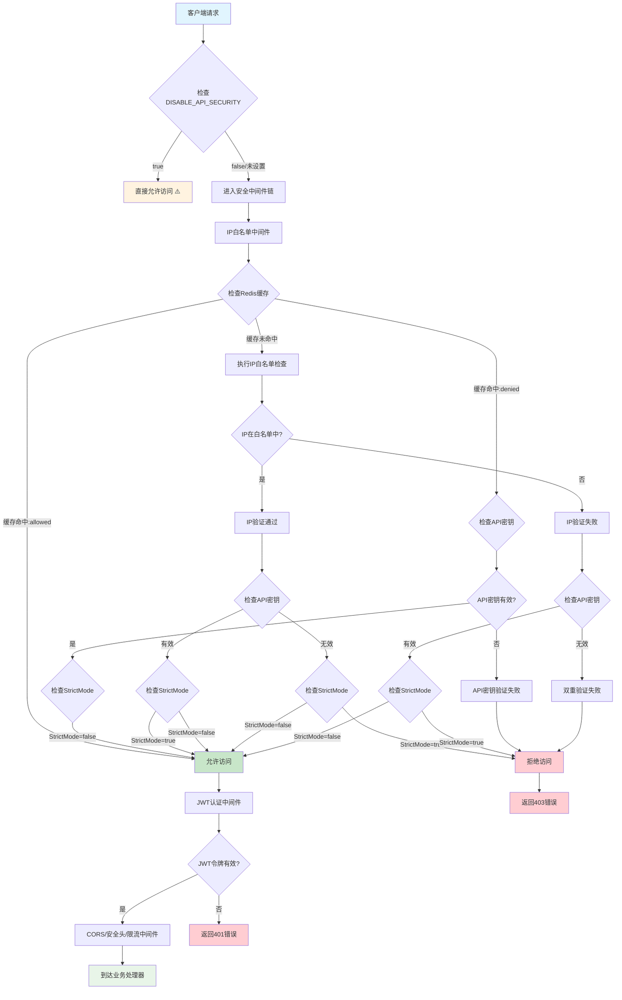

# 后端验证流程文档

## 验证流程图



## 验证流程说明

### 1. 安全开关检查
- **环境变量**: `DISABLE_API_SECURITY`
- **行为**: 如果设置为 `"true"`，完全跳过所有安全验证
- **风险**: ⚠️ 生产环境中极其危险，任何人都可以访问API

### 2. IP白名单验证

#### 2.1 缓存检查
- **Redis缓存键**: `ip:whitelist:{客户端IP}`
- **缓存值**: `"allowed"` 或 `"denied"`
- **缓存时间**: 5分钟
- **超时**: 200毫秒

#### 2.2 IP白名单规则
```
优先级顺序：
1. 开发模式检查 (API_DEV_MODE=true 跳过所有IP检查)
2. 环境变量TRUSTED_IPS (逗号分隔的IP列表)
3. 预定义TrustedIPsList (["127.0.0.1", "::1"])
4. 默认白名单:
   - 127.0.0.1 (本地回环)
   - ::1 (IPv6本地回环)
   - 10.0.0.0/8 (私有网络)
   - 172.16.0.0/12 (私有网络)
   - 192.168.0.0/16 (私有网络)
```

### 3. API密钥验证

#### 3.1 密钥获取方式
- **HTTP头部**: `X-API-KEY`
- **查询参数**: `apikey`
- **验证**: 与环境变量 `API_KEY` 进行字符串比较

#### 3.2 验证模式

**严格模式 (StrictMode=true)**
```
条件: IP白名单验证 AND API密钥验证
适用: 内部网络环境
风险: 全球用户无法访问
```

**非严格模式 (StrictMode=false)** 推荐
```
条件: IP白名单验证 OR API密钥验证
适用: 生产环境
优势: 全球用户可通过API密钥访问
```

### 4. JWT认证验证
- **位置**: IP白名单验证通过后
- **目的**: 确保请求包含有效的JWT令牌
- **获取**: 通过 `/api/auth/token` 端点

### 5. 其他安全中间件
- **CORS**: 跨域资源共享控制
- **安全头部**: 添加安全相关的HTTP头部
- **限流**: 防止API滥用
- **请求大小限制**: 最大10MB

## 配置说明

### 环境变量配置

| 变量名 | 说明 | 默认值 | 推荐值 |
|--------|------|--------|--------|
| `DISABLE_API_SECURITY` | 是否禁用API安全验证 | `false` | `false` |
| `IP_WHITELIST_STRICT_MODE` | IP白名单严格模式 | `true` | `false` |
| `API_DEV_MODE` | API开发模式 | `false` | `false` |
| `TRUSTED_IPS` | 受信任的IP列表 | 空 | 管理员IP |
| `API_KEY` | API访问密钥 | 无 | 强密码 |
| `JWT_SECRET` | JWT签名密钥 | 无 | 强密码 |

### 推荐的生产环境配置

```bash
# 安全配置
DISABLE_API_SECURITY=false
IP_WHITELIST_STRICT_MODE=false
API_DEV_MODE=false
TRUSTED_IPS=  # 留空或仅包含管理员IP
API_KEY=your_strong_api_key
JWT_SECRET=your_strong_jwt_secret

# Redis配置
REDIS_ADDR=localhost:6379
REDIS_PASSWORD=your_redis_password
```

## 使用说明

### 1. 获取JWT令牌

所有API请求都需要先获取JWT令牌：

```bash
curl -X POST http://localhost:3900/api/auth/token
```

### 2. 使用令牌访问API

将获取的令牌添加到请求头中：

```bash
curl -X GET http://localhost:3900/api/v1/whois/example.com \
  -H "Authorization: Bearer YOUR_TOKEN_HERE"
```

### 3. 使用API密钥访问

也可以直接使用API密钥访问（非严格模式下）：

```bash
# 通过请求头
curl -X GET http://localhost:3900/api/v1/whois/example.com \
  -H "X-API-KEY: your_api_key"

# 通过查询参数
curl -X GET "http://localhost:3900/api/v1/whois/example.com?apikey=your_api_key"
```